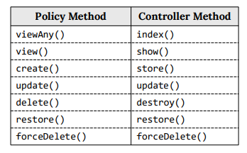

# Belajar  Policy
Dalam bahasa inggris, "policy" berarti "kebijakan". Istilah ini umum dijumpai dalam dunia
ekonomi atau pemerintah. Misalnya sebuah perusahaan membuat kebijakan agar karyawan
harus datang jam 8:00 pagi dan baru boleh pulang jam 4 sore. Atau pemerintah mengeluarkan
kebijakan tentang batas atas dan batas bawah harga tiket pesawat. 

# Pengertian Laravel Policy
Di dalam Laravel, Policy dipakai untuk membatasi hak akses user terdapat sebuah model.
Lebih spesifik lagi, model yang dimaksud adalah salah satu dari Restfull method yang tersedia
dari sebuah aplikasi CRUD.
Dengan policy, kita bisa membatasi hanya user dengan nama "admin" saja yang boleh
menginput data ke tabel jurusan. Atau user "rissa" tidak bisa menghapus, tetapi diizinkan
untuk melihat dan mengedit data jurusan. Inilah kebijakan bisa diatur dengan Laravel Policy.
Sekilas policy mirip seperti middleware. Policy bisa disebut sebagai bentuk yang lebih khusus
dari middleware

# Membuat Policy
Policy pada dasarnya berbentuk sebuah class yang disimpan dalam file khusus (mirip seperti
file controller, file model, file middleware, dll). Untuk membuat policy, tersedia perintah php
artisan dengan format berikut:
php artisan make:policy <NamaPolicy>
Karena policy akan dipakai untuk membatasi akses ke suatu model, bisa ditambah option -m
dengan format sebagai berikut:
php artisan make:policy <NamaPolicy> -m NamaModel

Class JurusanPolicy butuh mengimport 2 buah class model, yakni User model (berisi data
user yang sedang login), serta Jurusan model (tabel yang aksesnya ingin kita batasi). Selain itu
juga perlu mengimport class Illuminate\Auth\Access\HandlesAuthorization yang berfungsi
sebagai class dasar untuk operasional policy.

Terdapat 7 method di dalam JurusanPolicy yang nantinya mengembalikan nilai true atau false
tergantung batasan yang ingin kita buat. Semua method memiliki pasangan dengan method
RESTfull di Controller:

Cara bacanya adalah, jika kita ingin membatasi user agar tidak bisa melihat satu data tabel
yang di proses oleh method show() di controller, maka kode programnya di tulis dalam
method view() di Policy.
Atau jika kita ingin membatasi agar user tidak bisa menghapus data tabel (yang di proses oleh
method destroy() di controller), maka kode programnya harus ditulis dalam method delete()
di Policy. 

#  Membatasi Proses Create
membatasi proses input data jurusan. Di dalam
JurusanController, proses input ini ditangani oleh method store(). Dengan melihat daftar
tabel sebelumnya, method store() berpasangan dengan method create() di JurusanPolicy. 

        return $user->email === 'admin@gmail.com';

Kita sudah singgung sedikit bahwa setiap method di dalam Policy harus mengembalikan nilai
true atau false. Jika hasilnya true, maka proses bisa dijalankan. Jika hasilnya false, proses
tersebut akan ditolak.
Dalam contoh ini saya ingin memeriksa apakah email dari user yang sedang login sama dengan
'admin@gmail.com' atau tidak. Jika sama (true), maka proses input data jurusan bisa dilakukan.
Informasi mengenai alamat email dari user yang sedang login bisa diakses dari $user->email,
dimana variabel $user berasal dari penulisan argument method create() di baris 5.
Syarat berikutnya, kita harus tambahkan perintah khusus ke dalam method store() di
JurusanController:

Proses input jurusan berhasil! Karena alamat email 'admin@gmail,com' sesuai dengan syarat di
method create(). Inilah cara kerja dari Laravel Policy.
Syarat policy ini juga sangat fleksibel, tidak harus email tapi juga bisa menggunakan data lain
untuk proses identifikasi user. Misalnya bisa saya menulis syarat seperti ini:
public function create(User $user)
{
 return $user->name === 'Admin';
}
Kode ini akan mengizinkan user dengan name 'Admin' untuk melakukan input data. Tapi hatihati karena secara bawaan kolom name di tabel users bawaan Laravel tidak di set dengan
atribut unique. Sehingga bisa saja terdapat lebih dari 1 user bernama 'Admin' dan siapa saja bisa
mendaftarkan diri dengan nama 'Admin'.
Bagaimana jika kita ingin ada 2 user yang diberi hak akses? Tidak masalah, yang perlu diubah
hanya di logika pemeriksaan user.
Perhatikan contoh berikut:
public function create(User $user)
{
return ($user->email === 'admin@gmail.com')
 OR ($user->email === 'support@gmail.com');
}
Di sini saya menggabung 2 buah operasi perbandingan dengan operator OR, sehingga user
dengan email admin@gmail.com dan support@gmail.com akan bisa melakukan proses input
data.
Agar lebih rapi, logika di atas juga bisa juga ditulis menggunakan fungsi in_array():

# Membatasi Tampilan di View
Saat ini proses input data hanya bisa dilakukan oleh user admin. Namun di dalam view, menu
dan tombol "Tambah Jurusan" tetap tampil untuk semua user. Idealnya, tombol tersebut
hanya bisa dilihat untuk user admin saja, atau lebih baik lagi hanya bisa dilihat oleh user yang
memiliki hak akses untuk menambah data.

Blade memiliki fitur khusus untuk keperluan tersebut, yakni perintah @can dan @cannot serta
pasangan penutup @endcan dan @endcannot. Perintah @can dan @cannot butuh 2 argument
yang sama seperti method $this->authorize() di controller. Berikut contoh penggunaannya:

@can('create', App\Models\Jurusan::class)
    
Hanya bisa dilihat oleh user yang bisa men-create jurusan

 @endcan

Dengan penulisan ini, kode HTML di baris 2 hanya bisa dilihat oleh user yang memiliki hak
akses untuk melakukan proses create ke dalam tabel jurusan. Perhatikan penulisan argument
'create' dan App\Models\Jurusan::class untuk perintah @can. Ini sama seperti yang kita pakai
di dalam method $this->authorize().

Sebaliknya, perintah @cannot hanya bisa dilihat oleh user yang tidak memiliki hak akses:
@cannot('create', App\Models\Jurusan::class)
     
Hanya bisa dilihat oleh user yang tidak bisa men-create jurusan

 @endcan

Sekarang kode HTML di baris 2 hanya boleh dilihat oleh user yang tidak bisa melakukan
proses create ke dalam tabel jurusan.
Dalam praktek kita, terdapat 2 komponen yang memiliki link ke form tambah jurusan, yakni
menu navbar dan tombol di sisi kanan atas. Untuk menu navbar, kode programnya ada di view 
